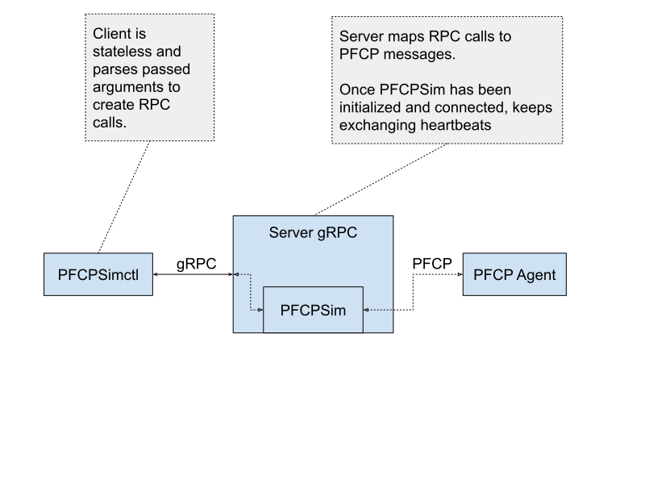

[](https://goreportcard.com/report/github.com/omec-project/pfcpsim)

# pfcpsim
pfcpsim is a simulator to interact with PFCP agents. Can be used to simulate a 4G SGW-C / 5G SMF.

> All related features are implemented according to the 3GPP TS 29.244 V16.3.1(2020-04).
## Overview

pfcpsim is designed to work within a containerized environment. The docker image comes with both client (`pfcpctl`) and server (`pfcpsim`).

`PFCPClient` is embedded in a gRPC Server. Interaction between pfcpsim and pfcpctl is performed through RPCs, as shown in the following schema: 



## Getting Started

### Normal Case

#### 1. Create the container. Images are available on [DockerHub](https://hub.docker.com/r/opennetworking/pfcpsim/tags):
```bash
docker container run --rm -d --name pfcpsim pfcpsim:<image_tag> -p 12345 --interface <interface-name>
```
 - `-p` (**optional**, default is 54321): to set a custom gRPC listening port
 - `--interface` (**optional**, default is first non-loopback interface): to specify a specific interface from which retrieve local IP address

#### 2. Use `pfcpctl` to configure server's remote peer address and N3 interface address:
```bash
docker exec pfcpsim pfcpctl -s localhost:12345 service configure --n3-addr <N3-interface-address> --remote-peer-addr <PFCP-server-address>
```
 - `-s`/`--server`: (**optional**, default is 'localhost:54321') the gRPC server address.
 - `service`: selects the service subparser.
 - `configure`: selects the Configure RPC that allows to set the addresses of the N3 interface and the remote PFCP agent peer.
 - `--n3-addr`: address of the N3 Interface between UPF and nodeB.
 - `--remote-peer-addr`: address of the PFCP server. It supports the override of the IANA PFCP port (e.g. `10.0.0.1:8888`).

To list all the available commands just append `--help`, when executing `pfcpctl`.

#### 3. `associate` command will connect to remote peer set in the previous configuration step and perform an association.
```bash
docker exec pfcpsim pfcpctl -s localhost:12345 service associate
```

#### 4. Create 5 sessions
```bash
docker exec pfcpsim pfcpctl -s localhost:12345 session create --count 5 --baseID 2 --ue-pool <CIDR-IP-pool> --gnb-addr <GNodeB-address> --sdf-filter 'permit out ip from 0.0.0.0/0 to assigned 81-81'
```
 - `--count` the amount of sessions to create
 - `--baseID` the base ID used to incrementally create sessions
 - `--ue-pool` the IP pool from which UE addresses will be generated (e.g. `17.0.0.0/24`)
 - `--gnb-addr` the (e/g)NodeB address 
 - `--sdf-filter` (optional) the SDF Filter to use when creating PDRs. If not set, PDI will contain a SDF Filter IE with an empty string as SDF Filter.

#### 5. Delete the sessions
```bash
docker exec pfcpsim pfcpctl --server localhost:12345 session delete --count 5 --baseID 2
```

#### 6. `disassociate` command will perform disassociation and close connection with remote peer.
```bash
docker exec pfcpsim pfcpctl --server localhost:12345 service disassociate
```

### Fuzzing Mode

Pfcpsim is able to generate the malformed PFCP message, it can be used to explore the the potential vulnerabilities of the PFCP agents (UPF).

> Note:
> PFCP fuzzer is developed by the [Ian Chen (free5GC team)](https://github.com/ianchen0119)
> PFCP fuzzer has been used to test the UPF implementation of the free5GC project, and successfully found some vulnerabilities.

To use the PFCP fuzzer, we need to prepare the fuzzing environment first. The following steps show how to use the PFCP fuzzer.

#### 1. Launch the UPF instance

Pfcpsim support to test various UPF implementations.
You can choose the UPF implementation you want to test, and launch the UPF instance.

#### 2. Change the configuration in `fuzz/ie_fuzz_test.go`

You should change the configuration in `fuzz/ie_fuzz_test.go`:
```go=
sim := export.NewPfcpSimCfg(iface, upfN3, upfN4)
```
- `iface`: the interface name you used to establish the connection with UPF.
- `upfN3`: the N3 interface address of the UPF.
- `upfN4`: the N4 interface address of the UPF.

#### 3. Run the fuzzing test

You can run the fuzzing test by the following command:
```
go test -fuzz=Fuzz -p 1 -parallel 1 -fuzztime 15m ./fuzz/...
```
- `-fuzztime`: the time you want to run the fuzzing test.
- Do not change the value of `-parallel` and `-p` flag, it will cause the race condition.

## Compile binaries
If you don't want to use docker you can just compile the binaries of `pfcpsim` and `pfcpctl`:

#### 1. Git clone this repository
```bash
git clone https://github.com/omec-project/pfcpsim && cd pfcpsim/
```

#### 2. Compile pfcpsim
```bash
go build -o server cmd/pfcpsim/main.go
```

#### 3. Compile pfcpctl
```bash
go build -o client cmd/pfcpctl/main.go
```

You can now place `server` and `client` wherever you want.
To setup pfcpsim use the same steps shown above (without executing `docker`). E.G:
```bash
./server -p 12345 --interface <interface-name>
```

